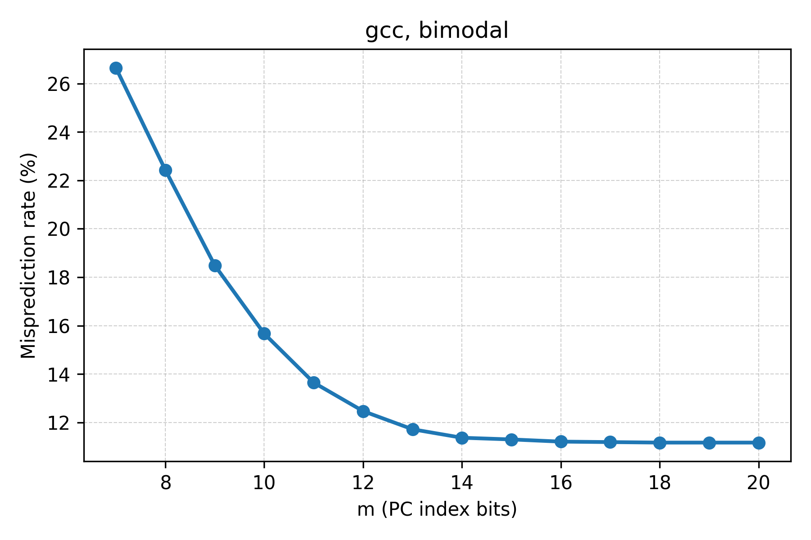
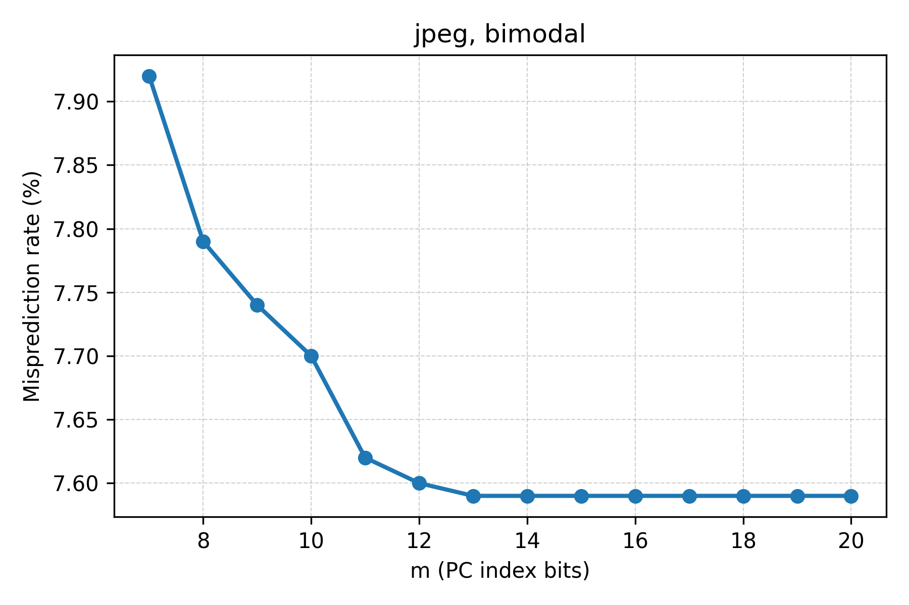
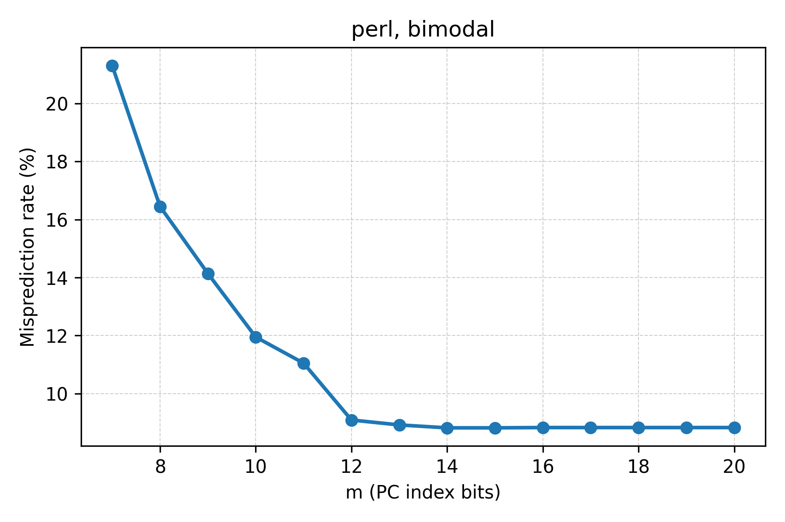
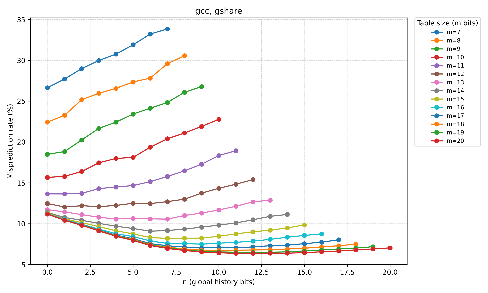

# NC State University
Department of Electrical and Computer Engineering  
ECE 463/563 (Prof. Rotenberg)  
Project #2: Branch Prediction  

**Student:** << YOUR NAME HERE >>
**NCSU Honor Pledge:** "I have neither given nor received unauthorized aid on this project."
**Student's electronic signature:** ____________________________  
**Course number:** 463  

---

## Grading Breakdown, Experiments, and Report

### Part 1: Bimodal Predictor

#### Experiments
Bimodal predictor sweeps were executed for m = 7 through m = 20 on the gcc, jpeg, and perl traces using the provided simulator (`./sim`). The misprediction rate for each configuration is plotted below.





#### Analysis
1. As the bimodal predictor's table size increases, the branch misprediction rate generally decreases as the table grows and then levels off once the table is large enough to eliminate interference.

2. Minimum misprediction points:

| Benchmark | m at minimum | Minimum misprediction rate (%) |
|-----------|--------------|-------------------------------|
| gcc | m = 18 | 11.17 |
| jpeg | m = 13 | 7.59 |
| perl | m = 14 | 8.82 |

3. At some point, increasing the bimodal predictor's table size is of no value. At this point, each static branch is allocated a dedicated entry (2-bit counter) in the table. Given that interference among different static branches is eliminated at this point, the only way to improve accuracy further is a better prediction algorithm.

4. gcc has more static branches than jpeg because gcc requires more table entries than jpeg before its misprediction rate bottoms out.

### Part 2: Gshare Predictor

#### Experiments
Gshare predictor sweeps were executed for m = 7 through m = 20, with global history lengths n = 0 through n = m using the gcc trace. The resulting misprediction rates are shown below.



#### Analysis
1. At small table sizes, global history can hurt accuracy. This is because there are too few counters to accommodate the extra indexing pressure from using history bits.

2. At large table sizes, global history helps accuracy. This is because there are abundant counters, so specializing by history yields additional wins.

3. Summary table of optimal global history length per table size:

| m | Best n | Lowest misprediction rate (%) | Bimodal misprediction rate (%) |
|---|--------|------------------------------|------------------------------|
| 7 | 0 | 26.65 | 26.65 |
| 8 | 0 | 22.43 | 22.43 |
| 9 | 0 | 18.49 | 18.49 |
| 10 | 0 | 15.67 | 15.67 |
| 11 | 1 | 13.64 | 13.65 |
| 12 | 1 | 12.04 | 12.47 |
| 13 | 7 | 10.56 | 11.72 |
| 14 | 6 | 9.08 | 11.37 |
| 15 | 7 | 8.20 | 11.30 |
| 16 | 9 | 7.49 | 11.21 |
| 17 | 11 | 7.03 | 11.19 |
| 18 | 10 | 6.73 | 11.17 |
| 19 | 12 | 6.47 | 11.17 |
| 20 | 11 | 6.37 | 11.17 |

4. The smallest bimodal predictor that achieves the best accuracy overall occurs on the jpeg trace with m = 13 and misprediction rate 7.59%.

5. The smallest gshare predictor that achieves the best accuracy overall is m = 20, n = 11 with misprediction rate 6.37%.

6. In conclusion, with adequate predictor storage budget, gshare rocks.

---

## Testing Checklist

- `./sim bimodal 6 ../test/proj2-traces/gcc_trace.txt`
- `./sim bimodal 9 ../test/proj2-traces/jpeg_trace.txt`
- `./sim bimodal 12 ../test/proj2-traces/perl_trace.txt`
- `./sim gshare 9 3 ../test/proj2-traces/gcc_trace.txt`
- `./sim gshare 15 8 ../test/proj2-traces/gcc_trace.txt`

To confirm outputs locally, compare against the validation logs:

```bash
diff -iw <(./sim bimodal 6 ../test/proj2-traces/gcc_trace.txt | sed 's|../test/proj2-traces/||') ../test/proj2-validation/val_bimodal_1.txt
diff -iw <(./sim gshare 9 3 ../test/proj2-traces/gcc_trace.txt | sed 's|../test/proj2-traces/||') ../test/proj2-validation/val_gshare_1.txt
```

## Rebuilding This Report

1. From the project root, ensure the simulator is built (`cd c_files && make`).
2. Run `python3 generate_report_assets.py` to regenerate tables, plots, and `report.md`.
3. Convert to PDF, for example with Pandoc: `pandoc report.md -o report.pdf`.
